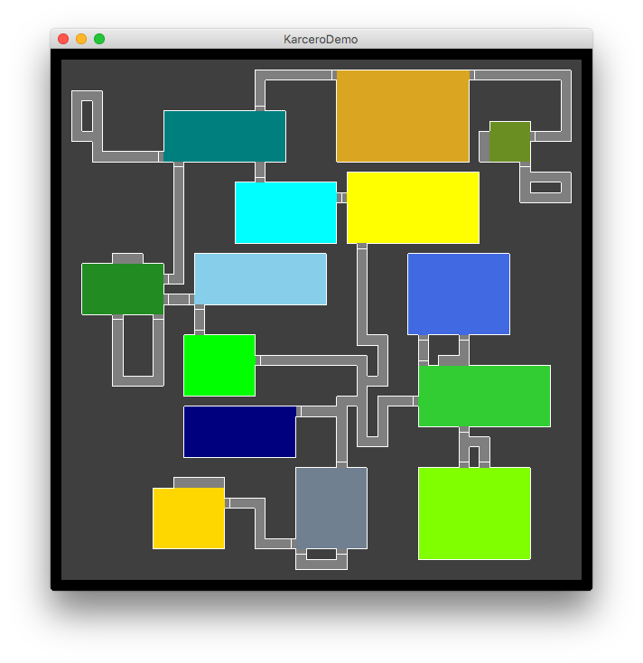
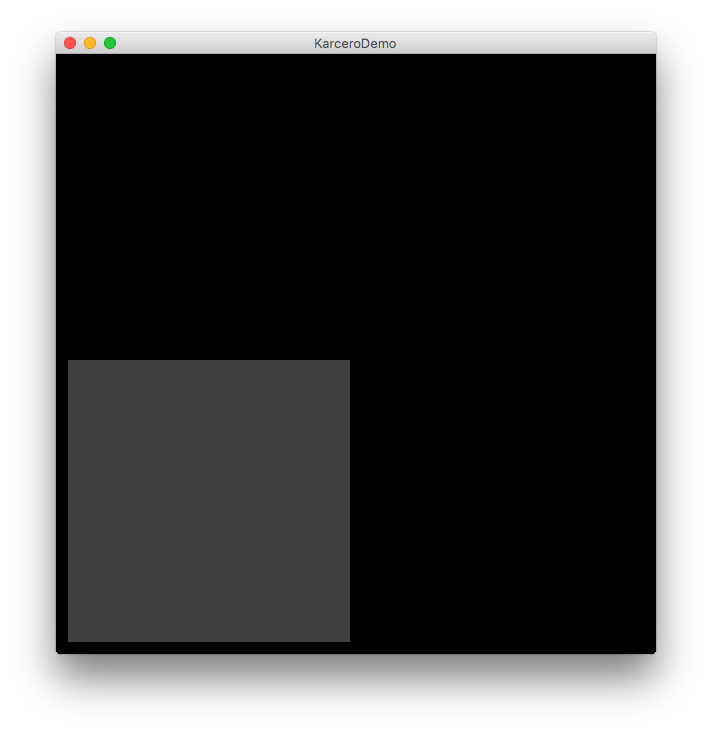
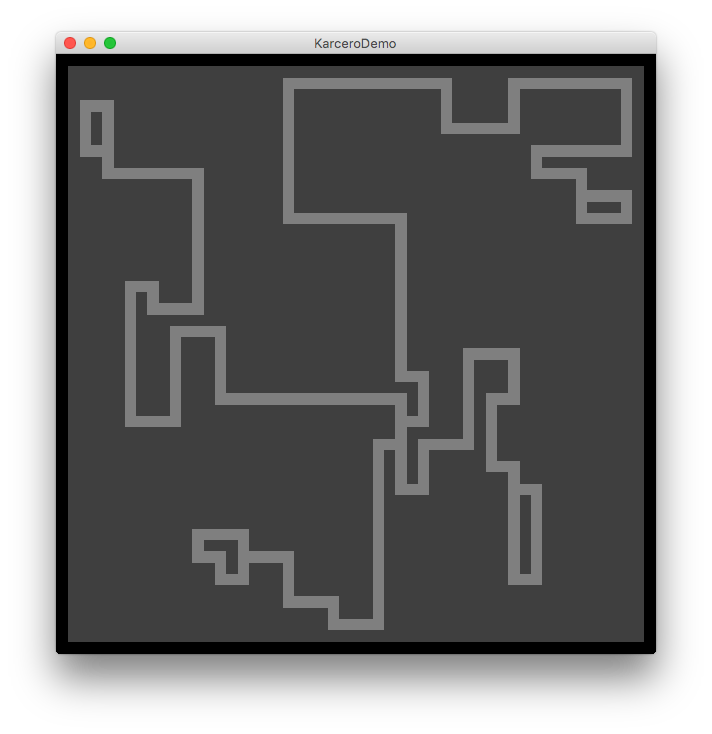
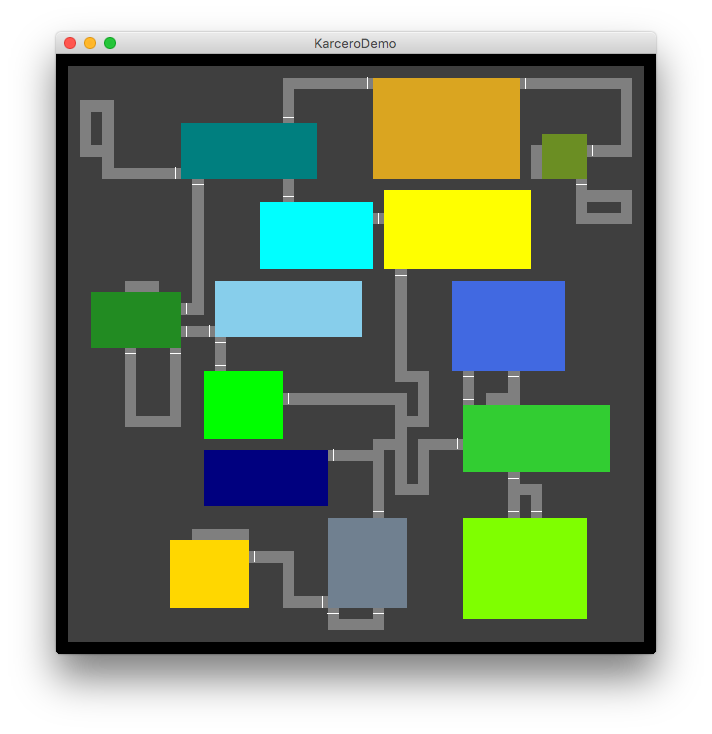

# Karcero-Kotlin
A port of the [Karcero C#](https://github.com/odedw/karcero) library, migrated to Kotlin with a few modifications.

I have been experimenting with procedural grid based maps while working on some hobby projects and found some great articles about maze algorithms, which led me to the open source [C# Karcero library](https://github.com/odedw/karcero).

The author of this library wrapped up a number of maze generation and processing algorithms nicely into a simple dungeon map generation system which is awesome. A lot of this repository is based on the C# code found in that repository.

As a hobby user of [LibGDX](https://libgdx.badlogicgames.com/), I wanted a Java compatible version of this library. As a result, I ported the C# version into Kotlin which is compatible with Desktop, Android and iOS LibGDX targets.

If you are a LibGDX user and want to target HTML then this library likely won't work for you (I haven't tried it) but you could always port this library to pure Java instead of Kotlin if you desire which would keep HTML compatibility.

## How to use this

This repository contains the Kotlin port of the C# Karcero library itself, alongside a sample demo LibGDX application show it being used in a simple way.

To run the demo app, navigate into the ```Karcero-Demo``` folder in terminal and run the following command:

```
./gradlew run
```

The first time it is run the dependencies will need to download so be patient.

If the demo runs successfully you will see something that looks similar to this:



## Basic usage

There are two *Gradle* based projects in this repository:

1. ```Karcero``` - the Kotlin library.
2. ```Karcero-Demo``` - a LibGDX based example of using the library.

Either project can be imported as a *Gradle* project into IntelliJ (community edition is fine) or Android Studio.

To run the demo application, import it then open the ```DesktopLauncher``` class and hit the small green *play* button next to the main function, e.g.

```
	// Hit the play button next to this line
    @JvmStatic fun main(arg: Array<String>) {
    	...
    }
```

To include the library in your own project, you can either compile the library into a *JAR* file like this:

```
// Navigate in terminal into the Karcero folder
./gradlew jar
```

or you can just copy the source folder from the library project into your own project, or add the library source folder as a source set into your own project.

During the generation of a dungeon, a ```DungeonConfiguration``` object is used to determine a whole bunch of random aspects of the output.

The most simple way to create a dungeon is:

```
val dungeon = Dungeon.create()
```

This will apply a default configuration with sensible defaults and run all the default processors.

The ```Dungeon.create()``` method can take a custom configuration along with an optional list of pre-processors and post-processors that will participate in the dungeon creation if provided.

When you have created a dungeon object, you can access its properties to interact with it. Some of the most common are:

```
dungeon.width
dungeon.height
dungeon.grid // The two dimensional array holding all the dungeon cells
dungeon.rooms // The collection of all the rooms in the dungeon
```

## Dungeon creation flow

The basic flow of creating a dungeon is by running a series of *processors* in succession, each time mutating the output of the previous processor.

Over the initialization phase a dungeon would come to life in steps looking somewhat like this:

**Step 1:** A blank grid is created and seeded with a maze generation algorithm.



**Step 2:** The generated maze is created with randomness, sparseness and the removal of *dead end* corridors. The result is also doubled in size and refined.



**Step 3:** A set of *rooms* is generated based on the configuration supplied and the rooms are placed into the dungeon if possible.


**Step 4:** Doors are added between corridors and rooms, based on configuration randomness and rules about where doors can be placed.



**Step 5:** Walls are added that follow the edges of corridors and rooms, forming a data model that can be understood to know what surrounds any given dungeon cell.


## Summary

The dungeon that is generated can be used as a backing model for visual rendering. In the demo app it is being rendered as a simple 2D grid, but it could be applied to a 3D environment or 2D side on game or something.

*end*